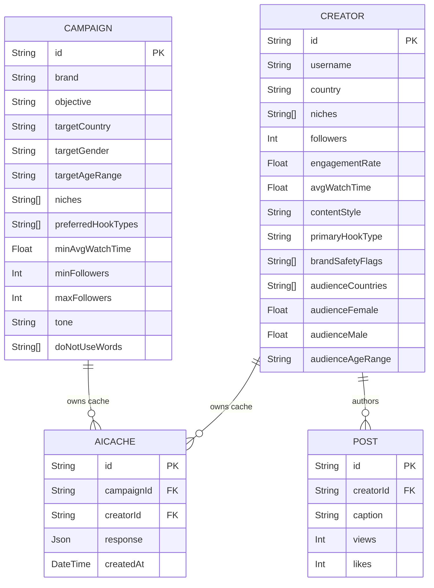

# Database Schema

```mermaid
erDiagram
    CAMPAIGN ||--o{ AICACHE : "owns cache"
    CREATOR ||--o{ AICACHE : "owns cache"
    CREATOR ||--o{ POST : "authors"

    CAMPAIGN {
        String id PK
        String brand
        String objective
        String targetCountry
        String targetGender
        String targetAgeRange
        String[] niches
        String[] preferredHookTypes
        Float minAvgWatchTime
        Int minFollowers
        Int maxFollowers
        String tone
        String[] doNotUseWords
    }
    
    CREATOR {
        String id PK
        String username
        String country
        String[] niches
        Int followers
        Float engagementRate
        Float avgWatchTime
        String contentStyle
        String primaryHookType
        String[] brandSafetyFlags
        String[] audienceCountries
        Float audienceFemale
        Float audienceMale
        String audienceAgeRange
    }

    POST {
        String id PK
        String creatorId FK
        String caption
        Int views
        Int likes
    }

    AICACHE {
        String id PK
        String campaignId FK
        String creatorId FK
        Json response
        DateTime createdAt
    }
```
